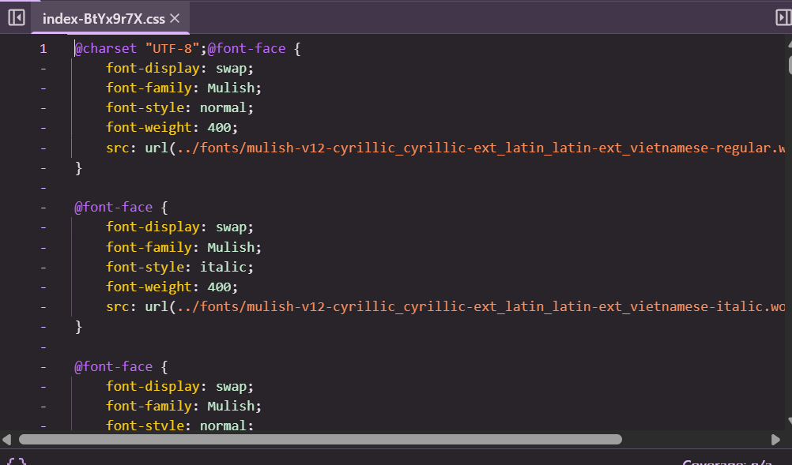
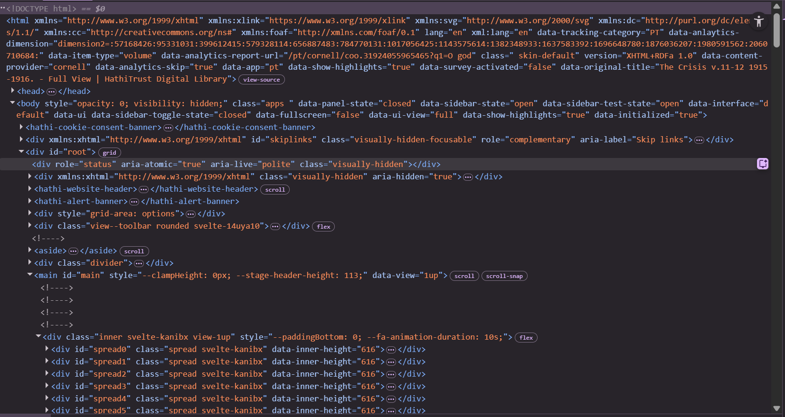
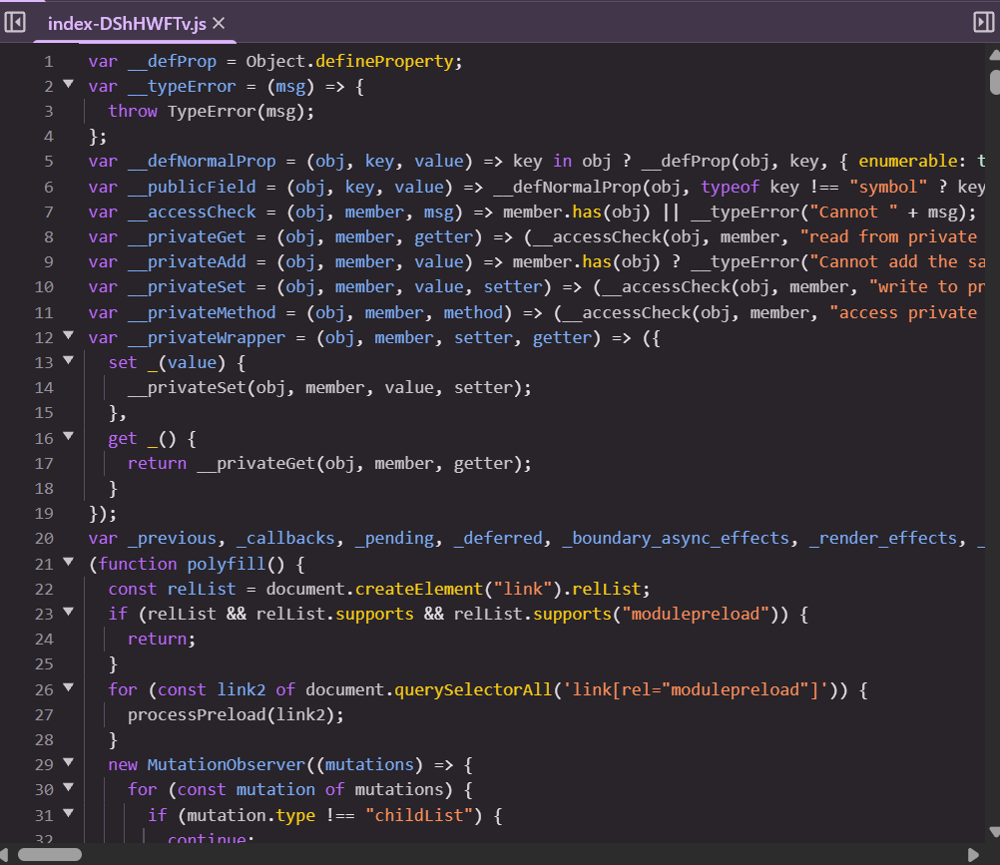

# Source and Style Assignment 1: Inspecting the Cultural Web

## Website
https://babel.hathitrust.org/cgi/pt?id=coo.31924055965465&seq=516&q1=O+god

## GitHub Repository
https://github.com/hathitrust/babel

## Web Technologies Used

The HathiTrust Book Viewer uses standard web technologies:

1. HTML for page structure  
2. CSS for styling and layout  
3. JavaScript for interactivity and navigation  

The site loads compiled CSS and JavaScript files that control the appearance and behavior of the interface.

HEre is an example of a CSS file:

Here is an example of the HTML structure of the page:

Here is an example of a JavaScript (JS) file:

---

## Who Built the Website

The website is maintained by the HathiTrust organization. Development is done by a team rather than a single individua; according to the github.

The project repository shows changes made as of yesterday and multiple contributors:

---
